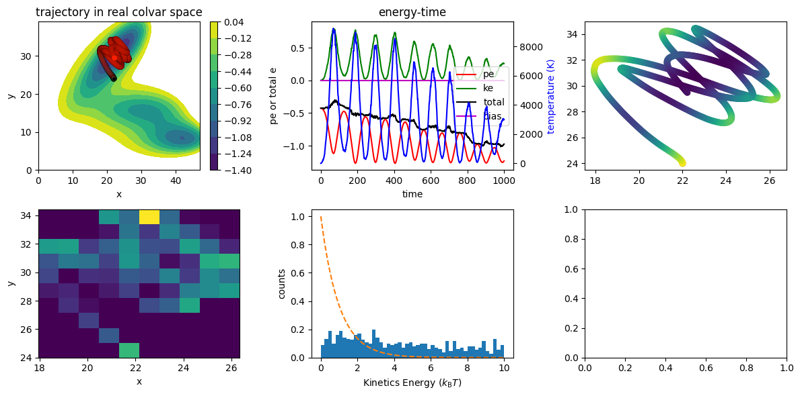
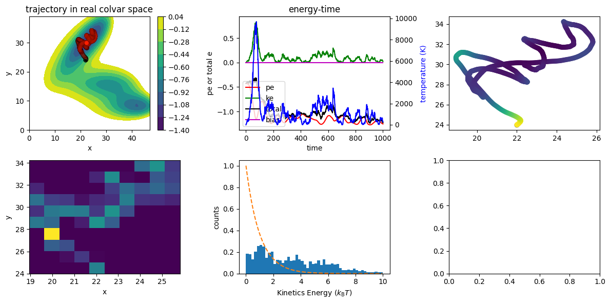
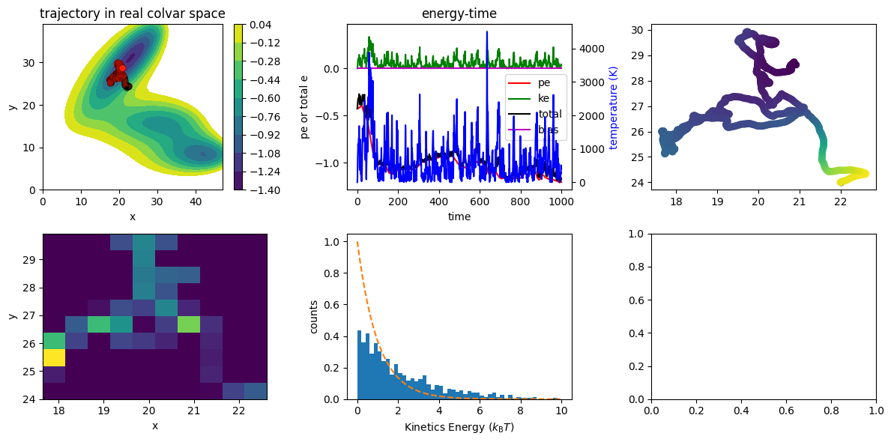

Tutorials
=========

Basic run
~~~~~~~~~

1. Run a demo example.

   .. highlight:: bash
   .. code-block:: bash
   
      ndsimulator examples/2d-md.yaml
   
   The yaml file can be found on the github repo or as shown below. 
   We will explain the arguments one by one in the following section.
   
   .. literalinclude:: ../../examples/2d-md.yaml
      :language: yaml

2. With the arguments ``root: ./reference`` and  ``run_name: md_gamma_0.1``, the call will generate a folder in `rference/md_gamma_0.1`

   .. highlight:: bash
   .. code-block:: bash
   
     ls reference/md_gamma_0.1/
     $ colvar.dat  force.dat  log  oneplot.png  pos.dat  thermo.dat  velocity.dat
   
   Each dat file includes the positions (pos.dat), forces (force.dat), velocities (velocity.dat), temperature (thermo.dat)

   ``log`` file contains the screen output and some additional information 

   1. ``dump``: if True, the `.dat` files will be generated
   2. ``dump_freq``: control how often the data is saved

   Relevant python interface sees :ref:`Dump <dump_automodule>`

3. The simulation result is automatically visualized in the ``oneplot.png``

   .. figure:: ../../reference/md_gamma_0.1/oneplot.png
   
   The details of each panel and their arguments see :ref:`Plot <plot_automodule>` and :ref:`LightPlot <light_plot_automodule>`

Langevin dynamics
~~~~~~~~~~~~~~~~~

The key arguments for langevin dynamics is ``dt`` and ``gamma``. The choice of ``dt`` depends on the energy landscape.

Unlike in MD with real atoms, the N-dimensional landscape is more sensitive to ``dt`` options.
A large ``dt`` will let the particle move to super high energy region way to fast.

``gamma`` on the otherhand, control the friction forces that are applied to the particle.

See below for three simulations with three gamma values to get a sense.

   gamma=0.001

   gamma=0.01

   gamma=0.1